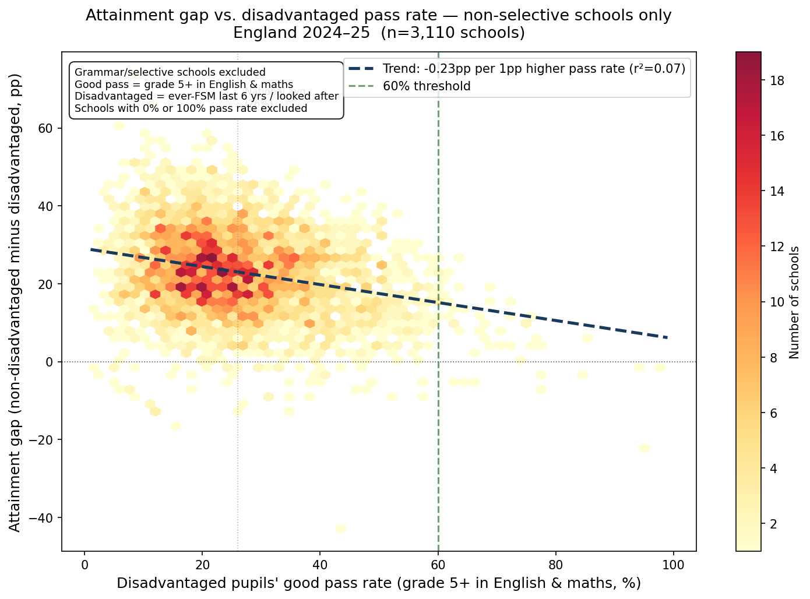
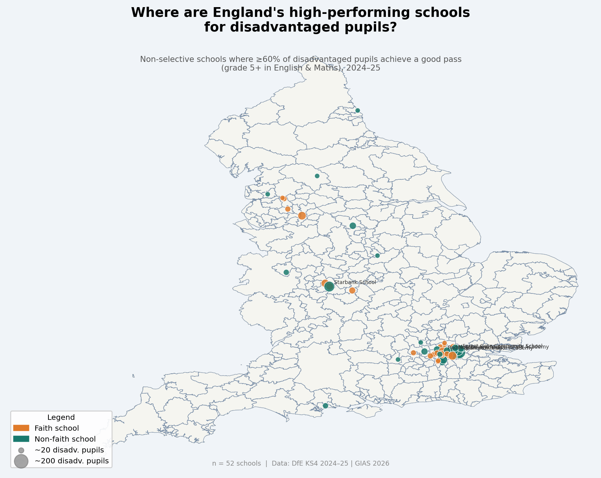
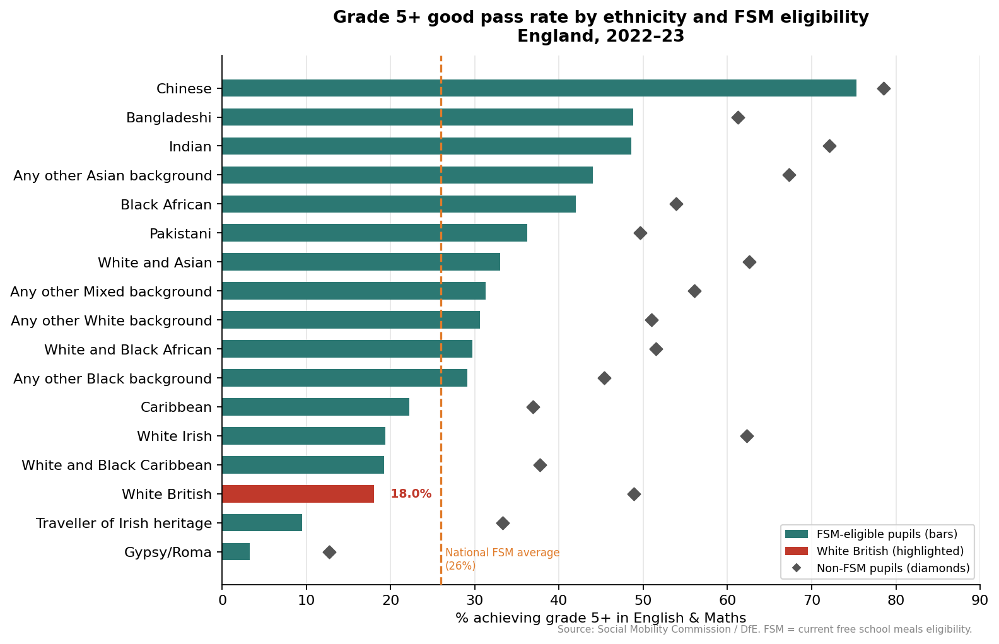
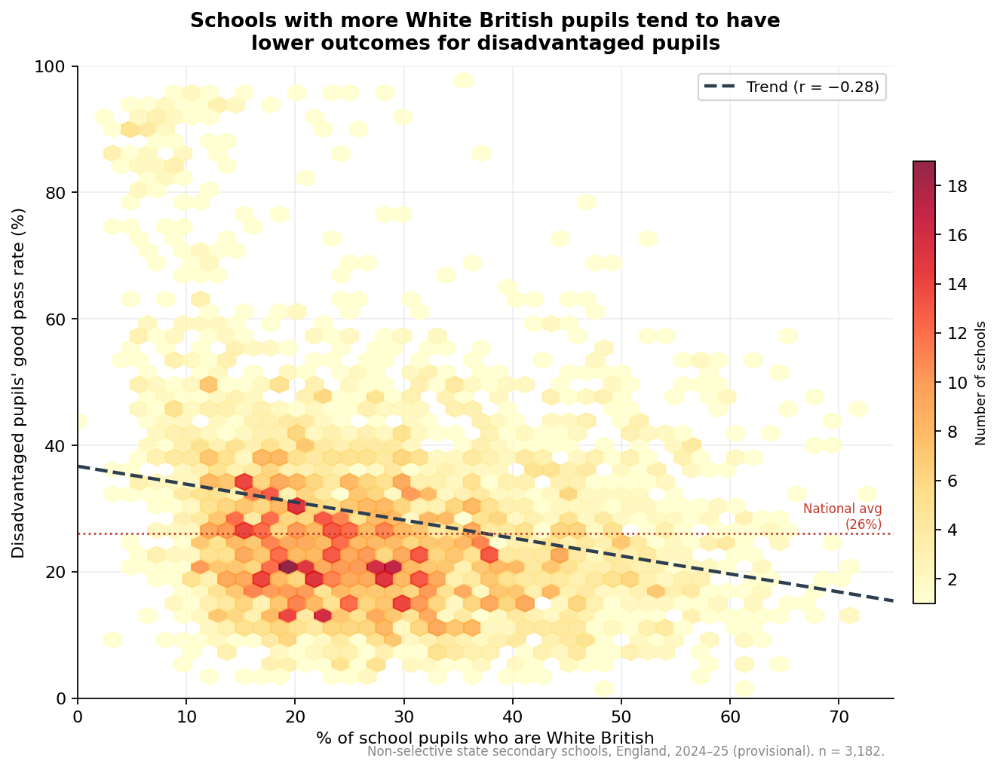
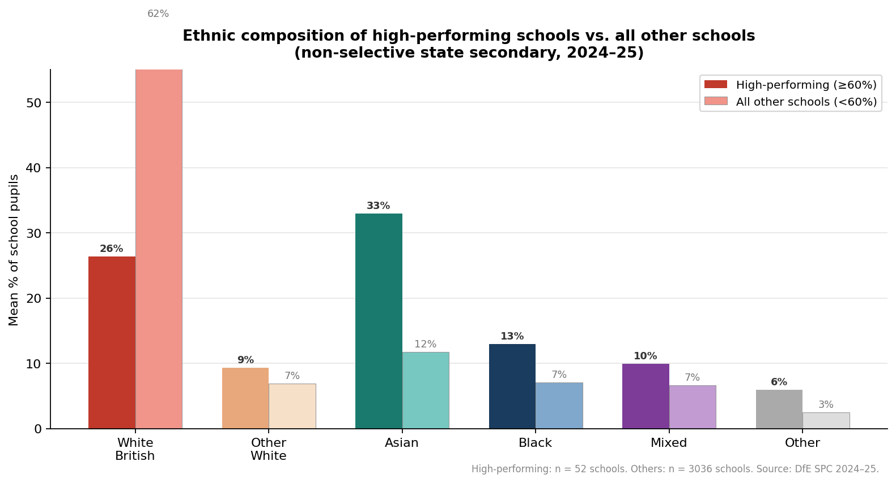

\vspace{0.5cm}

# The Gap That Isn't Closing

Every year, fewer than **three in ten** disadvantaged pupils in England achieve a "good pass" — grade 5 or above in both GCSE English Language and Mathematics. Among their better-off classmates, it is more than **five in ten**.

That gap — around 27 percentage points — is wider today than it was before the pandemic. Despite billions of pounds in Pupil Premium funding, despite decades of school improvement effort, and despite a stated government commitment to halve it, the gap has barely moved.

This briefing uses the most recent published data (2024–25) to ask a more focused question: **are there schools that are beating the odds?** And if so, what can we learn from them?

---

# The National Picture

**What we mean by a "good pass":** GCSE grade 5 or above in *both* English Language and Mathematics. This is the government's "strong pass" measure — one step above the grade 4 standard pass. It is widely used as a threshold for progression to A-level and higher education.

**What we mean by "disadvantaged":** Pupils who have been eligible for free school meals at any point in the past six years, or who are looked after. This is the definition used for Pupil Premium funding — it is broader than current free school meal eligibility, and better reflects persistent disadvantage.

## Most recent national results (2023–24)

The most recent published national breakdown by disadvantage status is from 2023–24. (2024–25 provisional results have been published at school level — which forms the basis of the school analysis later in this briefing — but the national headline percentages by disadvantage group had not been published at the time this briefing was prepared.)

\vspace{0.3cm}

| Group | Good pass rate (2023–24) |
|:------|-------------------------:|
| Disadvantaged pupils | **26%** |
| Non-disadvantaged pupils | **53%** |
| **Gap** | **27 percentage points** |

\vspace{0.3cm}

The Schools White Paper (February 2026) sets a national ambition to **halve this gap** — from around 27pp to approximately 13–14pp. On current trends, that would require disadvantaged pupils' pass rate to rise from 26% to around 40%, or a combination of improvement at the bottom and narrowing from the top.

## How has it changed?

The gap has **widened since 2019**, not narrowed. The 2018–19 figure was 25pp; the 2023–24 figure is 27pp. The COVID years (2020–22) saw inflated grades across the board and are not comparable. But even comparing 2018–19 directly with 2023–24, there has been no closing of the gap.

---

# The Graph: What 3,000 Schools Tell Us

The chart below shows every non-selective secondary school in England for which 2024–25 data are available — around 3,100 schools in total. Each dot represents one school.

- **Horizontal axis:** The percentage of a school's disadvantaged pupils who achieved a good pass (grade 5+ in English and Maths).
- **Vertical axis:** The gap at that school — how far disadvantaged pupils trail their non-disadvantaged classmates.

The colour density shows where most schools cluster. The vertical red dashed line marks 60% — a threshold we use to identify genuinely outstanding performance.

\vspace{0.3cm}

\vspace{0.3cm}

**What the chart shows:**

The mass of schools clusters in the 10–40% range for disadvantaged pass rates — consistent with the national average of 26%. Most schools also show a gap of 15–30pp.

There is a clear downward trend: schools with higher pass rates for disadvantaged pupils tend to have **smaller gaps**. But the relationship is modest — raising outcomes for disadvantaged pupils does not automatically compress the gap, and some high-performing schools for disadvantaged pupils still have substantial gaps (because their non-disadvantaged pupils also do very well).

The schools to the right of the red dashed line — 52 non-selective schools with 60%+ pass rates for disadvantaged pupils — are the subject of the rest of this briefing.

---

# The Map: Where Are the High-Performing Schools?

The map below shows those 52 schools plotted across England.

- **Colour** indicates the school's religious character: faith schools are shown in orange; non-faith in teal.
- **Size** indicates the number of disadvantaged pupils in the cohort — larger circles = more pupils.

\vspace{0.3cm}

\vspace{0.3cm}

The geographic concentration is striking. **London dominates.** Around two-thirds of the 52 schools are in the capital. Outside London, there are scattered examples in the North West and Yorkshire, but very few in the Midlands, South West, or East of England.

This is partly a structural story — London has more free schools, more academy chains with strong disadvantage track records, and a higher density of faith schools serving diverse urban communities. But it also raises a direct question for NIoT: **where is the equivalent provision in the rest of the country?**

---

# Who Are These Schools?

## Key facts about the 52 schools

- **25 are faith schools** (48%) — compared with around 30% of state secondary schools nationally. Catholic schools and Church of England schools are both represented, alongside schools with Islamic character.
- **33 are in London** (63%) — particularly Inner and East London.
- **Many belong to strong academy chains**: Star Academies, Ark Schools, Harris Federation, and Mossbourne Community Academy Trust are all represented. **8 of the 52 are in Star Academies alone.**
- **Most are relatively large** — median roll of around 800–1,000 pupils, with substantial disadvantaged cohorts. These are not small schools where a handful of pupils can move the needle.

## What these schools have in common

Several features recur across the 52 schools, though none is universal:

**1. Strong chain membership.** The majority belong to multi-academy trusts with an explicit and long-standing commitment to disadvantage. Star Academies, Ark, and Harris all have documented approaches to closing the gap — structured curricula, high-dosage tutoring, extended school days, and rigorous professional development for staff. This is not accidental excellence; it is systematically built in.

**2. London location and the "London Effect".** The concentration in London reflects two decades of sustained improvement effort in the capital. The London Challenge (2003–2011) transformed some of the country's worst-performing schools. Many of today's high-performing chains grew out of that period. The effects persist — but they also demonstrate that context matters. London schools operate in a different labour market, funding environment, and policy ecosystem.

**3. Faith character.** Catholic and Islamic schools appear disproportionately in this group. Research suggests this may relate to school ethos, parental engagement, and the motivation structures that religious schools can sustain. This finding is not straightforward to transfer — but it points to the value of strong, shared school culture.

**4. Size and stability.** These are mostly established schools with experienced leadership. None appears to be a recent turnaround case — the evidence suggests sustained, consistent performance over multiple years rather than a one-year spike.

---

# Implications for the National Institute of Teaching

The Pupil Premium good pass gap is one of the most politically and professionally salient measures in English education. The government has committed to halving it. NIoT's work — on teacher development, school leadership, and evidence-based practice — sits directly in the frame.

Several observations are relevant:

**1. The gap is structural, not just instructional.** The schools closing the gap are not simply those with better lessons. They combine strong curriculum design, coherent professional development, effective use of Pupil Premium funding, and sustained senior leadership commitment. NIoT's teacher development offer must be embedded in this broader ecology, not treated as a stand-alone intervention.

**2. The regional distribution is a challenge.** Two-thirds of high-performing schools are in London. NIoT's national footprint — and its mission to reach teachers in areas of greatest need — points directly toward the areas where equivalent schools are absent: the East Midlands, South West, and coastal towns. A targeting question follows: should NIoT prioritise placements and partnerships in these underserved regions?

**3. The chain effect is real and transferable.** Star Academies and Ark have demonstrated that sustained improvement for disadvantaged pupils is achievable at scale. Understanding how these chains develop their teachers — and how NIoT can learn from and work with them — is a live strategic question.

**4. The 60% threshold is not a ceiling.** The national average is 26%. That 52 non-selective schools have cleared 60% — double the national rate — shows that the structural barriers are not insuperable. It also implies that the Schools White Paper target (roughly 40%) is achievable in principle, but will require more than incremental improvement in most of the country.

---

# The Ethnicity Dimension: White British Pupils and the Disadvantage Gap

The school-level analysis above tells one part of the story. But it conceals something important: **not all disadvantaged pupils are equally likely to achieve a good pass, and ethnicity is a major factor**.

## White British FSM pupils: near the bottom

The chart below shows the grade 5+ good pass rate for FSM-eligible pupils broken down by ethnic group (England, 2022–23). Diamond markers show the equivalent rate for non-FSM pupils in each group.

\vspace{0.3cm}

\vspace{0.3cm}

**White British FSM-eligible pupils achieve just 18%** — the second lowest of any named ethnic group, above only Traveller of Irish Heritage and Gypsy/Roma pupils. This compares to:

- **49%** for Bangladeshi FSM pupils
- **49%** for Indian FSM pupils
- **42%** for Black African FSM pupils
- **26%** national average across all disadvantaged pupils

Two features of this chart deserve attention. First, the gap between FSM and non-FSM pupils is enormous for White British pupils — **31 percentage points** — larger than for almost any other group. FSM status is a particularly strong predictor of low attainment among White British pupils. Second, many minority ethnic groups whose FSM pupils underperform nationally (e.g. Pakistani, Caribbean) still substantially outperform White British FSM pupils.

## At school level: the same pattern holds

The chart below shows, for each non-selective secondary school in England, the relationship between the proportion of pupils who are White British and the school's disadvantaged good pass rate.

\vspace{0.3cm}

\vspace{0.3cm}

The downward trend is clear: **schools with higher proportions of White British pupils tend to have lower pass rates for their disadvantaged pupils** (r = -0.28). Schools with fewer than 20% White British pupils average a **40% pass rate** for disadvantaged pupils; schools with more than 37% White British pupils average around **26%** — equal to the national average for disadvantaged pupils but far below what the most diverse schools are achieving.

This pattern is not simply an artefact of school location or funding. It reflects the compounding disadvantage faced by White British FSM pupils — who are, on average, further behind their non-FSM White British peers than almost any other group.

## What this means

The framing of the "disadvantage gap" as a single number conceals large variation by ethnicity. The aggregate 27pp gap between disadvantaged and non-disadvantaged pupils is, in part, driven by the especially low outcomes of White British disadvantaged pupils — who make up the **largest single group** of FSM pupils in England (around 80,000 pupils in the 2022/23 KS4 cohort).

This has direct implications for how school improvement strategies are designed. Approaches that have worked well in highly diverse urban schools — strong academy chains, high expectations, disciplined curricula — may not translate straightforwardly to schools serving predominantly White British communities in post-industrial towns, coastal areas, or rural England. **The geography of the gap maps closely onto the geography of White British disadvantage**: the East Midlands, Yorkshire, the North East, and coastal towns are over-represented among schools where disadvantaged pupils do worst.

For NIoT, this points to a targeting question that goes beyond the urban/rural divide: **what does effective teacher development look like in schools where White British disadvantaged pupils are the majority, and where the traditional narratives around diversity and inclusion may not apply?**

---

# Bringing It Together: Ethnicity and the High-Performing Schools

The two threads of this analysis — the 52 schools beating the odds, and the stark gap in outcomes for White British FSM pupils — are directly connected. The ethnic composition of the high-performing schools is not incidental to their success: it is central to understanding it.

## The ethnic make-up of high-performing schools

The chart below compares the average ethnic composition of the 52 non-selective schools achieving 60%+ for disadvantaged pupils, against all other non-selective secondary schools.

\vspace{0.3cm}

\vspace{0.3cm}

| Ethnic group | High-performing schools | All other schools | Difference |
|:-------------|------------------------:|------------------:|-----------:|
| White British | 26% | 62% | -36pp |
| Asian | 33% | 12% | +21pp |
| Black | 13% | 7% | +6pp |
| Mixed | 10% | 7% | +3pp |
| Other White | 9% | 7% | +2pp |

The contrast is stark. In the typical English secondary school, **62% of pupils are White British**. In the 52 high-performing schools, that figure is just **26%**. Conversely, Asian pupils make up 33% of high-performing schools on average, compared to 12% in the rest.

## What this does — and does not — mean

This finding demands careful interpretation. It does **not** mean that schools succeed simply by virtue of having fewer White British pupils. It means that:

**1. High-performing schools are disproportionately serving communities where disadvantaged pupils from minority ethnic groups — particularly South Asian groups — tend to achieve relatively well.** As the ethnicity chart earlier showed, Bangladeshi, Indian, Pakistani, and Black African FSM pupils all substantially outperform White British FSM pupils. Schools with high proportions of these pupils will, mechanically, show higher average pass rates for "disadvantaged pupils" as a group.

**2. London's dominance compounds this.** Two-thirds of the 52 schools are in London, which has both a higher concentration of minority ethnic pupils and a sustained legacy of school improvement investment. Disentangling the ethnic composition effect from the London Effect is not possible with this data alone.

**3. The high-performing schools are still genuinely impressive.** Even within minority ethnic groups, FSM pass rates are typically well below 50%. Schools achieving 60%+ for their entire disadvantaged cohort — which includes a mix of ethnic groups — are doing something real. The chains (Star Academies, Ark, Harris) are not simply lucky in their intake; they apply structured, evidence-based approaches that raise outcomes across ethnic groups.

**4. The corollary is the hardest finding.** There are very few high-performing schools for disadvantaged White British pupils. Those schools exist in smaller numbers, tend to be in London (where even White British communities are more mixed), and are not well-represented in the post-industrial towns and coastal communities where White British FSM pupils are most concentrated. **The absence of high-performing schools in those areas is, in effect, a failure of the system to develop and sustain effective approaches for this specific population.**

## The implication for NIoT

The analysis points to a specific and under-addressed challenge: **what does excellent teaching and school leadership look like for predominantly White British, disadvantaged communities?** The approaches that have driven improvement in diverse urban schools are real and important. But they are not sufficient to close the gap nationally.

Halving the disadvantage gap — the Schools White Paper ambition — will require building a new evidence base around what works for White British disadvantaged pupils specifically: in the schools, towns, and regions where they are concentrated, and where the current system is most conspicuously failing them. This is where NIoT's reach beyond London and into underserved regions could make its most distinctive contribution.

---

# Technical Notes

**Data:** DfE Key Stage 4 Performance tables, 2024–25 (provisional). School-level breakdown by disadvantage status. "Good pass" = `engmath_95_percent` (grade 5+ in both English Language and Mathematics GCSE). Disadvantaged = ever-FSM in past 6 years + looked after children (pupil premium definition). Non-selective schools identified via GIAS (Get Information About Schools) admissions policy data. *n* = 3,110 non-selective state-funded secondary schools with non-suppressed disadvantaged data. 2,275 schools suppressed (typically where the disadvantaged cohort is fewer than 6 pupils).

**Map boundaries:** England local authority boundaries from martinjc/UK-GeoJSON. School coordinates from GIAS Easting/Northing (OSGB36), converted to WGS84.

**COVID caveat:** 2019–20 to 2021–22 results (centre- and teacher-assessed grades) are not comparable with exam years and are excluded from trend analysis.

**Ethnicity data:** Grade 5+ by ethnicity × FSM from Social Mobility Commission / DfE Attainment at Age 16 dataset (2022–23). School-level White British proportions from DfE Schools, Pupils and Their Characteristics 2024–25 (January 2025 census), school-level underlying data file. Joined to KS4 disadvantage data by URN; 3,232 schools matched.

**Analysis:** Python (pandas, matplotlib, pyproj). Data collected April 2026.

---

*Prepared April 2026 using data from the Department for Education and the National Institute for Teaching's research priorities. Contact: calumdavey@gmail.com*
